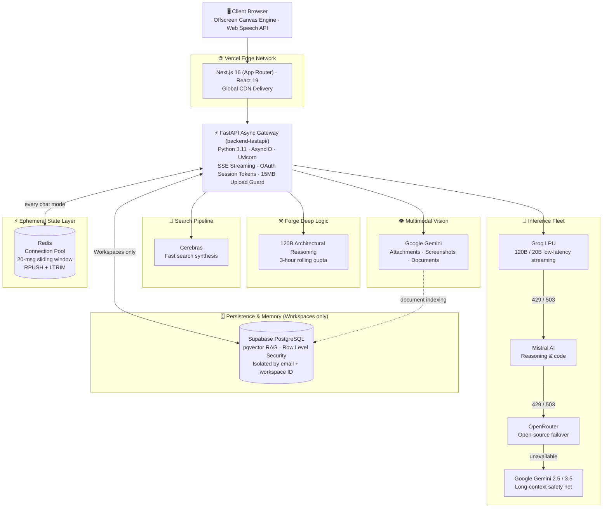
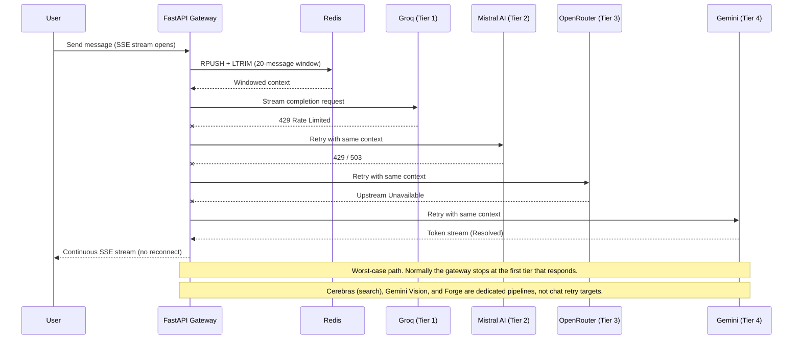

<div align="center">

  <h1 align="center">
    
    <br/>
    UBAIR OS
  </h1>

  ### Autonomous Multi-Model AI Operating System & Ephemeral Neural Workspace

  [](https://nextjs.org/)
  [](https://react.dev/)
  [](https://fastapi.tiangolo.com/)
  [](https://redis.io/)
  [](https://supabase.com/)
  [](https://tailwindcss.com/)
  [](https://ubair-os.vercel.app)
  [](LICENSE)

  <p align="center">
    <b>Ubair OS</b> is a multi-model AI workspace built around a zero-persistence <b>Temporary Chat</b> default, a Redis-backed 20-message sliding window, multi-tenant <b>Workspaces</b> with pgvector RAG memory, and an on-demand 120B <b>Forge</b> reasoning engine — orchestrated by an async FastAPI gateway across Groq, Gemini, Mistral AI, OpenRouter, and Cerebras.
  </p>

  <p align="center">
    <a href="https://ubair-os.vercel.app"><strong>✨ Experience Live App Now →</strong></a>
    &nbsp;•&nbsp;
    <a href="#-architecture"><strong>🏗️ Architecture</strong></a>
    &nbsp;•&nbsp;
    <a href="#-local-development-setup"><strong>⚙️ Run Locally</strong></a>
    &nbsp;•&nbsp;
    <a href="#-engineering-challenges--solutions"><strong>🧠 Engineering Decisions</strong></a>
  </p>

</div>

---

## 📑 Table of Contents

- [Why Ubair OS](#-why-ubair-os)
- [Demo](#-demo)
- [Feature Overview](#-feature-overview)
- [Chat Modes](#-chat-modes)
- [Architecture](#-architecture)
- [Multimodal Ingestion & Hardened Boundaries](#-multimodal-ingestion--hardened-boundaries)
- [Engineering Challenges & Solutions](#-engineering-challenges--solutions)
- [Flagship Workstations](#-flagship-workstations)
- [Tech Stack](#-tech-stack)
- [Project Structure](#-project-structure)
- [Local Development Setup](#-local-development-setup)
- [Environment Variables](#-environment-variables)
- [Deployment](#-deployment)
- [Security & Privacy](#-security--privacy)
- [Roadmap](#-roadmap)
- [Contributing](#-contributing)
- [Author](#-author)
- [License](#-license)

---

## 💡 Why Ubair OS

Most AI tools are a single chat box tied to a single model, with persistence you never asked for. When the model rate-limits, the conversation dies. Memory is shallow, uploads are fragile, and the UI is an afterthought.

Ubair OS answers a different question: *what if an AI workspace were ephemeral by default, persistent only when you choose, and fast regardless of which model is serving you?*

| Problem with typical AI tools | How Ubair OS handles it |
| --- | --- |
| Every conversation is silently logged | **Temporary Chat** is the default: transient in-memory session ID, zero persistent database logging, wiped on page reload |
| Unbounded context growth | Redis **20-message atomic sliding window** (`RPUSH` + `LTRIM`) keeps context bounded and fast |
| One provider outage = dead chat | Multi-provider inference fleet with automatic failover that preserves context mid-stream |
| Shallow reasoning on hard problems | **Forge Deep Logic Mode**: dedicated 120B architectural reasoning engine, on demand, with a rolling 3-hour quota |
| Slow, shallow web-grounded answers | Cerebras handles fast search synthesis |
| Text-only assistants | Gemini multimodal vision for attachments, screenshots, and document indexing |
| Context lost between sessions | **Workspaces** with per-tenant vector document vaults and long-term memory (Supabase + pgvector) |
| Fragile file handling | 15MB per-file boundary at client **and** server, scanned-PDF detection, graceful fallbacks |
| Heavy, janky animations | Offscreen sprite blitting for a 60–120 FPS canvas with no WebGL dependency |

---

## 🎬 Demo

<div align="center">

  

  <br/><br/>

  | Neural Chat Stream | Workspace Canvas |
  | :---: | :---: |
  |  |  |

  | Ambient Founder Inbox | Mobile Viewport Ergonomics |
  | :---: | :---: |
  |  |  |

</div>

---

## ✨ Feature Overview

- ⏳ **Temporary Chat (default)** — zero-persistence ephemeral workspace with a transient in-memory session ID
- 🧮 **Redis sliding-window memory** — 20-message atomic window via `RPUSH` / `LTRIM`, served through pooled connections
- 🗂️ **Multi-tenant Workspaces** — persistent directories isolated by user email and workspace ID, with vector document vaults and long-term memory
- ⚒️ **Forge Deep Logic Mode** — on-demand 120B architectural reasoning engine with a dynamic 3-hour rolling quota
- 🤖 **Multi-model inference fleet** — Groq LPU (120B / 20B), Google Gemini (2.5 / 3.5), Mistral AI, OpenRouter, and Cerebras
- 🔎 **Fast search synthesis** powered by Cerebras
- 👁️ **Multimodal vision** on Gemini: attachment analysis, screenshot understanding, document indexing
- 🧠 **Vector RAG** over Supabase PostgreSQL + pgvector, isolated per workspace
- ⚔️ **Assessment Arena** — multi-model cognitive evaluation and Socratic concept defense fleet
- 🎨 **Specialized Workstations** — Image Studio master rendering and zero-trace Slate with PIN-based cross-device sync
- 📄 **Hardened ingestion** — 15MB per-file cap, scanned-PDF (image-only) detection, CSV/TSV profiling and blueprint generation
- 🌌 **Ambient Cosmic Galaxy** — 60–120 FPS 2D/3D trigonometric projection canvas via offscreen sprite blitting
- 🧭 **Chat ergonomics** — turn-number jump (`#1`, `#2`, …), in-chat message search, one-click code copy
- 🎙️ **Voice** — Web Speech API dictation and real-time TTS audio generation
- 🔔 **Founder inbox** for release notes and broadcasts (pin / read / dismiss)
- 📱 **Mobile-first ergonomics** with a safe-area aware input dock
- 🔐 **Google OAuth 2.0** sign-in — no passwords stored

---

## 🕹️ Chat Modes

| Mode | Persistence | Memory | Intended use |
| --- | --- | --- | --- |
| **Temporary Chat** *(default Quick Mode)* | **None.** Transient in-memory session ID that wipes completely on page reload. Zero persistent database logging. | Redis 20-message sliding window | Quick questions, sensitive prompts, scratch reasoning |
| **Workspaces** | Persistent, multi-tenant. Directories isolated by **user email + workspace ID**. | Vector document vaults (pgvector) + long-term memory | Ongoing projects, document-grounded chat |
| **Forge Deep Logic** | Toggled on demand | Dedicated 120B parameter architectural reasoning engine | Deep system design, hard debugging, multi-step logic |

> **Forge quota:** Forge runs under a dynamic **3-hour rolling quota management system**.

---

## 🧱 Architecture

Ubair OS separates workloads by purpose instead of pushing everything through one model: an **inference fleet** for chat and reasoning, a **dedicated search pipeline** (Cerebras), a **dedicated vision pipeline** (Gemini), an **ephemeral cache layer** (Redis) for sliding-window session state, and a **persistence layer** (Supabase + pgvector) that only Workspaces touch.

### System Overview



> **Temporary Chat performs zero persistent database logging.** Its conversational state lives in Redis (bounded to a 20-message window) and in a transient in-memory session ID that disappears on reload.

### Chat Failover Flow



### ASCII Overview

```text
                      +----------------------------------------------+
                      |      CLIENT BROWSER                          |
                      |  60-120 FPS Offscreen Canvas Engine          |
                      +----------------------------------------------+
                                              |
                                              v
                      +----------------------------------------------+
                      |      VERCEL EDGE NETWORK                     |
                      |  Next.js 16 (App Router) · React 19          |
                      +----------------------------------------------+
                                              |
                                              v
                      +----------------------------------------------+
                      |   FASTAPI ASYNC GATEWAY (backend-fastapi/)   |
                      |  Python 3.11 · AsyncIO · Uvicorn             |
                      |  SSE Pipelines · 15MB Upload Guard           |
                      +----------------------------------------------+
                                              |
              +-------------------------------+-------------------------------+
              |                               |                               |
              v                               v                               v
+---------------------------+   +---------------------------+   +---------------------------+
|     INFERENCE FLEET       |   |   DEDICATED PIPELINES     |   |   EPHEMERAL STATE LAYER   |
| Groq LPU (120B/20B)       |   | Search : Cerebras         |   | Redis (pooled)            |
| Mistral AI                |   | Vision : Gemini           |   | 20-msg sliding window     |
| OpenRouter                |   | Forge  : 120B reasoning   |   | RPUSH + LTRIM (atomic)    |
| Gemini 2.5 / 3.5          |   |          (3-hr quota)     |   +---------------------------+
+---------------------------+   +---------------------------+
                                              |
                                              v
                      +----------------------------------------------+
                      |   PERSISTENCE & MEMORY  (Workspaces only)    |
                      |  Supabase PostgreSQL + pgvector RAG          |
                      |  Isolated by user email + workspace ID       |
                      +----------------------------------------------+
```

---

## 📥 Multimodal Ingestion & Hardened Boundaries

| Boundary | Behavior |
| --- | --- |
| **15MB per-file limit** | Enforced at **both** the client and the FastAPI endpoints — the client rejects early, the server never trusts the client |
| **Scanned-PDF detection** | Image-only PDFs with no extractable text are detected automatically and return a graceful fallback notice instead of an empty or misleading result |
| **Tabular profiling** | CSV and TSV assets are autonomously profiled and a blueprint is generated for them |
| **Vision inputs** | Images, screenshots, and attachments are routed to the Gemini multimodal pipeline |

---

## 🧠 Engineering Challenges & Solutions

### 1. Unbounded context vs. zero persistence
**Problem:** An ephemeral chat still needs short-term memory, but writing it to a database defeats the point.
**Solution:** Redis holds a 20-message atomic sliding window per session using `RPUSH` followed by `LTRIM`, with connection pooling to keep per-request overhead low. The session ID is transient and in-memory only, so a page reload starts a completely fresh session.

### 2. Provider rate limits killing conversations
**Problem:** A single LLM provider returning `429` or `503` would end the user's stream.
**Solution:** A self-healing router walks the inference fleet (Groq → Mistral AI → OpenRouter → Gemini). Each hop reuses the same windowed context, so the SSE stream continues uninterrupted.

### 3. One model can't be best at everything
**Problem:** Chat, search synthesis, vision, and deep reasoning have very different latency and capability needs.
**Solution:** Workloads run in dedicated pipelines: the chat fleet for conversation, Cerebras for fast search synthesis, Gemini for multimodal vision, and Forge (120B) for deep architectural reasoning.

### 4. Protecting scarce heavyweight reasoning capacity
**Problem:** A 120B reasoning engine is a heavyweight resource; unrestricted access would exhaust it.
**Solution:** Forge is toggled on demand and governed by a dynamic 3-hour rolling quota management system.

### 5. Hostile or unusable uploads
**Problem:** Oversized files and image-only PDFs waste inference budget and produce confusing output.
**Solution:** A 15MB boundary is enforced on both client and server, and scanned PDFs are detected up front and answered with a clear fallback notice.

### 6. Particle rendering performance
**Problem:** Computing radial gradients per particle per frame throttles the CPU, especially on mobile.
**Solution:** The Ambient Cosmic Galaxy pre-renders particles once into offscreen sprites and blits them each frame using trigonometric 2D/3D projection — no external WebGL dependency, 60–120 FPS.

### 7. Hydration mismatches
**Problem:** Time-based greetings render differently on server and client, causing React hydration errors.
**Solution:** Greetings and tenure milestones are computed client-side after hydration.

### 8. Mobile gesture-bar collisions
**Problem:** Input controls overlapped system gesture areas on phones.
**Solution:** A dedicated safe-area padded input dock and compacting header layout.

---

## 🧰 Flagship Workstations

| Workstation | What it does |
| --- | --- |
| **Neural Chat** | Streaming multi-model chat with markdown, syntax-highlighted code with one-click copy, turn-number jump, in-chat search, Web Speech dictation, and real-time TTS |
| **Workspace Canvas** | Multi-tenant project isolation with pgvector document vaults and persistent context memory |
| **Assessment Arena** | Multi-model cognitive evaluation, Socratic concept defense, and automated capability benchmark scoring |
| **Forge Studio** | Deep Logic Mode: 120B architectural reasoning engine governed by a dynamic rolling 3-hour quota |
| **Image Studio** | Multi-frame visual generation, ratio control, and master HD prompt workstation |
| **Zero-Trace Slate** | Ephemeral scratchpad and local vault with secure PIN-based cross-device sync |
| **Founder Inbox** | Platform broadcast studio and notification channel with local pin / read / dismiss controls |

---

## 🔬 Tech Stack

| Layer | Technologies | Purpose |
| --- | --- | --- |
| **Frontend** | Next.js 16 (App Router), React 19, TypeScript | SSR, strict type safety, edge delivery |
| **Styling & Canvas** | Tailwind CSS, custom Canvas 2D engine | Dark-tier design, offscreen sprite blitting at 60–120 FPS |
| **API Gateway** | Python 3.11, FastAPI, AsyncIO, Uvicorn (`backend-fastapi/`) | Async streaming, multipart handling, upload enforcement |
| **Cache / Ephemeral State** | Redis (connection pooling) | 20-message atomic sliding window via `RPUSH` / `LTRIM` |
| **Persistence & Vectors** | Supabase PostgreSQL, pgvector | Workspace storage, RAG embeddings, long-term memory |
| **Auth** | NextAuth.js, Google OAuth 2.0 | Isolated user sessions, zero password footprint |
| **Inference Fleet** | Groq LPU (120B / 20B), Google Gemini (2.5 / 3.5), Mistral AI, OpenRouter | Primary chat, reasoning, failover, long-context safety net |
| **Search Synthesis** | Cerebras | Fast web search synthesis |
| **Multimodal Vision** | Google Gemini | Attachment, screenshot, and document analysis |
| **Voice** | Web Speech API, TTS audio generation | Dictation and spoken responses |
| **Hosting** | Vercel (frontend), FastAPI gateway host, managed Redis, Supabase | Edge UI plus async API tier |

---

## 📁 Project Structure

```text
ubair-os/
├── frontend-nextjs/        # Next.js 16 app (App Router, React 19, TypeScript)
│   └── public/assets/      # Logo and static assets
├── backend-fastapi/        # FastAPI async gateway (Python 3.11)
│   ├── app/
│   │   └── main.py         # Application entry point
│   └── requirements.txt
├── docs/
│   └── assets/             # README screenshots and diagrams
├── LICENSE
└── README.md
```

---

## 🚀 Local Development Setup

### Prerequisites

- **Node.js** v18.18 or higher
- **Python** 3.11
- **Redis** (local instance or managed)
- **Git**
- A **Supabase** project (with the `pgvector` extension enabled), a **Google OAuth** client, and API keys for Groq, Cerebras, Mistral AI, OpenRouter, and Gemini

### 1. Clone the repository

```bash
git clone https://github.com/Md-Salik-Ubair/ubair-os.git
cd ubair-os
```

### 2. Start Redis

```bash
# Docker (quickest)
docker run -d --name ubair-redis -p 6379:6379 redis:7

# or use a locally installed server
redis-server
```

### 3. Start the backend

```bash
cd backend-fastapi
python3.11 -m venv venv

# Windows
venv\Scripts\activate
# Linux / macOS
source venv/bin/activate

pip install -r requirements.txt
```

Create `backend-fastapi/.env` (see [Environment Variables](#-environment-variables)), then:

```bash
uvicorn app.main:app --host 0.0.0.0 --port 8000 --reload
```

### 4. Start the frontend

Open a second terminal in the project root:

```bash
cd frontend-nextjs
npm install
```

Create `frontend-nextjs/.env.local`, then:

```bash
npm run dev
```

Open **http://localhost:3000** — you're in.

---

## 🔑 Environment Variables

**Frontend** — `frontend-nextjs/.env.local`

| Variable | Description |
| --- | --- |
| `NEXTAUTH_URL` | Base URL of the app (`http://localhost:3000` locally) |
| `NEXTAUTH_SECRET` | Random secret used by NextAuth to sign sessions |
| `GOOGLE_CLIENT_ID` | Google OAuth client ID |
| `GOOGLE_CLIENT_SECRET` | Google OAuth client secret |
| `NEXT_PUBLIC_API_URL` | Backend gateway URL (`http://localhost:8000` locally) |

**Backend** — `backend-fastapi/.env`

| Variable | Description |
| --- | --- |
| `REDIS_URL` | Redis connection string (e.g. `redis://localhost:6379/0`) for the sliding-window cache |
| `SUPABASE_URL` | Supabase project URL |
| `SUPABASE_SERVICE_ROLE_KEY` | Supabase service role key (**never expose to the client**) |
| `GROQ_API_KEY` | Groq LPU inference (120B / 20B) |
| `MISTRAL_API_KEY` | Mistral AI reasoning and code generation |
| `OPENROUTER_API_KEY` | OpenRouter open-source failover |
| `GEMINI_API_KEY` | Gemini chat fallback and multimodal vision |
| `CEREBRAS_API_KEY` | Fast search synthesis |

> 💡 Generate a `NEXTAUTH_SECRET` with `openssl rand -base64 32`.
>
> ⚠️ Variable names above should match your backend's settings module; adjust `REDIS_URL` if your gateway reads host/port/password separately.

---

## 🌍 Deployment

| Component | Platform | Notes |
| --- | --- | --- |
| Frontend | **Vercel** | Connect the repo, set root directory to `frontend-nextjs`, add env vars |
| Backend | **FastAPI web service** | Run `uvicorn app.main:app --host 0.0.0.0 --port $PORT` with root directory `backend-fastapi` |
| Cache | **Managed Redis** | Provide the connection string via `REDIS_URL` |
| Database | **Supabase** | Enable `pgvector`; apply RLS policies before exposing Workspaces |

---

## 🔒 Security & Privacy

- **Zero-persistence default:** Temporary Chat performs no persistent database logging. Its session ID is transient and in-memory, and is wiped completely on page reload.
- **Bounded server-side state:** Ephemeral context lives only in Redis, capped at a 20-message atomic sliding window.
- **Multi-tenant isolation:** Workspaces are isolated by user email and workspace ID, and bound to authenticated Google OAuth identities.
- **Row Level Security:** Supabase RLS policies restrict data access per user.
- **Defense-in-depth uploads:** The 15MB per-file boundary is enforced at the client and again at the FastAPI endpoints; the server never trusts client-side validation.
- **Graceful degradation:** Image-only (scanned) PDFs are detected and answered with a fallback notice rather than processed blindly.
- **Transport security:** The frontend is served over HTTPS from the Vercel Edge Network.
- **No public model training:** User code, documents, and prompts are not sold or submitted to public training datasets.
- **Secrets stay server-side:** Service-role keys, Redis credentials, and provider API keys live only in backend environment variables.

---

## 🧭 Roadmap

- [x] Temporary Chat with zero-persistence default
- [x] Redis 20-message atomic sliding window with connection pooling
- [x] Multi-tenant Workspaces with pgvector document vaults
- [x] Forge Deep Logic Mode with 3-hour rolling quota
- [x] Multi-provider inference fleet with automatic failover
- [x] Cerebras search synthesis & Gemini multimodal vision
- [x] 15MB upload boundaries, scanned-PDF detection, CSV/TSV profiling
- [x] Ambient Cosmic Galaxy canvas (60–120 FPS)
- [x] Web Speech dictation & real-time TTS
- [x] Mobile-optimized input dock & gesture safety
- [ ] Autonomous tool-use execution agent (Web Search & Code Interpreter)
- [ ] Multi-document batch embedding pipelines

---

## 🤝 Contributing

Contributions, issues, and feature ideas are welcome.

1. Fork the repository
2. Create a branch: `git checkout -b feature/your-feature`
3. Commit your changes: `git commit -m "feat: add your feature"`
4. Push the branch: `git push origin feature/your-feature`
5. Open a Pull Request

---

## 👨‍💻 Author

<div align="center">

**Md Salik Ubair**
B.Tech CSE (AI/ML) • Full-Stack AI Engineer

[](https://github.com/Md-Salik-Ubair)
[](https://ubair-os.vercel.app)

</div>

> *"Ubair OS was not built in a weekend hackathon. It was born out of continuous engineering, late-night debugging, resolving silent hook misalignments, and solving free-tier cloud limits. The mission was singular: to create a sovereign, fast, and beautiful intelligence tool built by a developer, for developers."*

---

## 📄 License

Distributed under the **MIT License**. See [`LICENSE`](LICENSE) for details.

<div align="center">

⭐ **If Ubair OS helped or inspired you, consider starring the repo.** ⭐

</div>