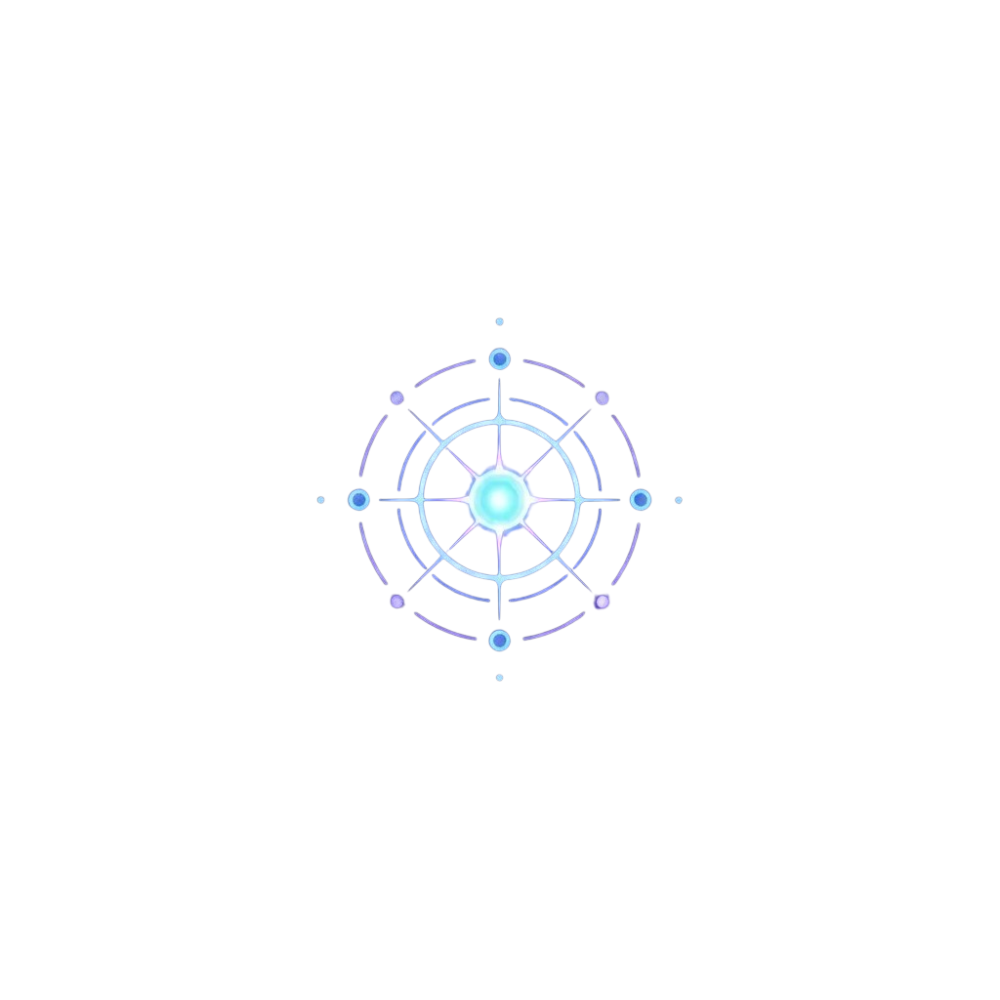
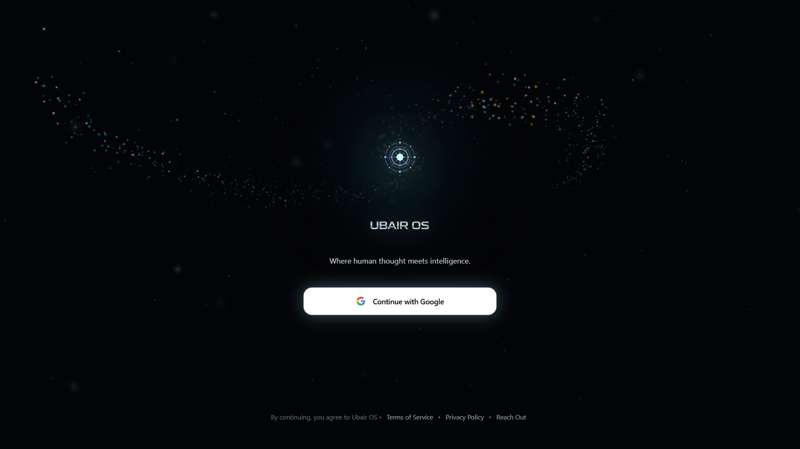
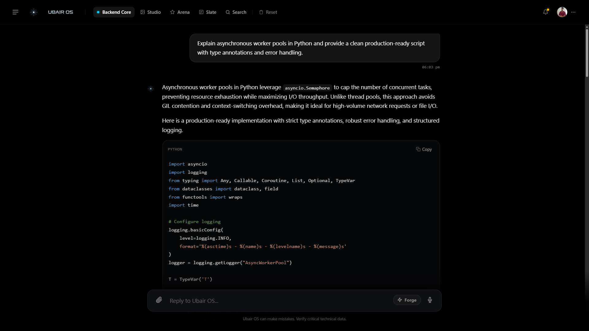
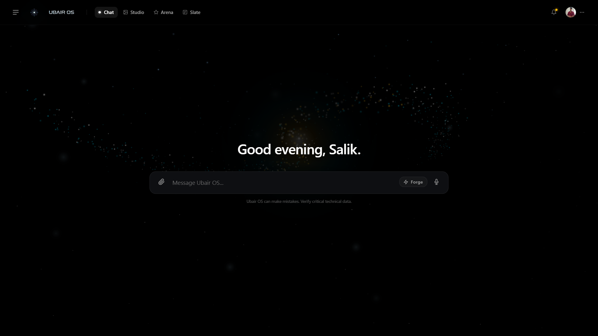
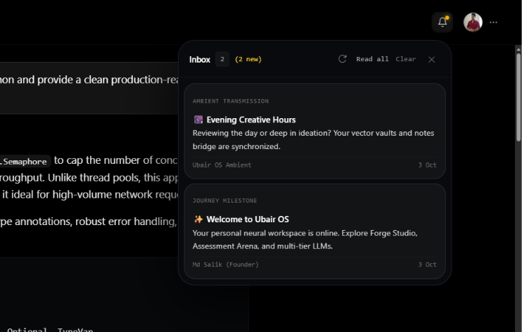
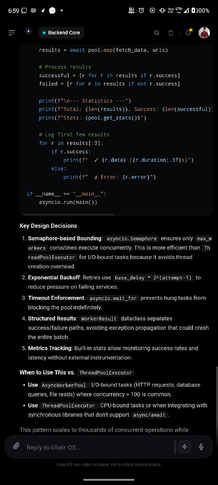
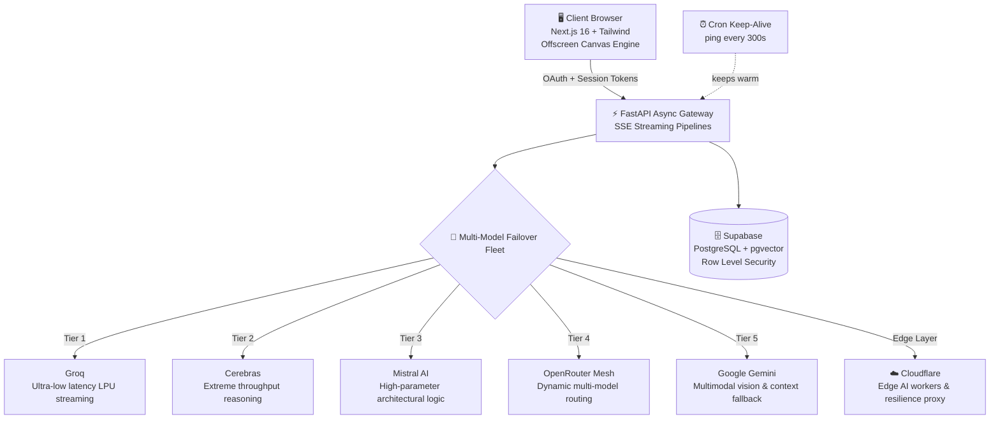
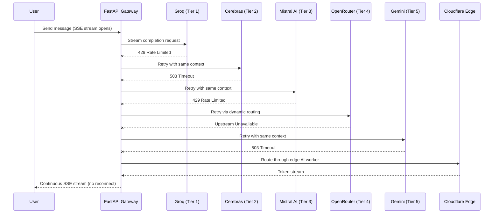

<div align="center">

  

  # UBAIR OS
  ### The Autonomous Neural Workspace for High-Velocity Builders & Thinkers

  [](https://nextjs.org/)
  [](https://react.dev/)
  [](https://fastapi.tiangolo.com/)
  [](https://supabase.com/)
  [](https://tailwindcss.com/)
  [](LICENSE)

  <p align="center">
    <b>Ubair OS</b> is a multi-modal AI workspace that combines multi-model chat, vector-grounded memory (RAG), and a high-performance visual canvas — running on a resilient, zero-cost cloud mesh with a five-tier automatic LLM failover fleet and a Cloudflare edge layer.
  </p>

  <p align="center">
    <a href="https://ubair-os.vercel.app"><strong>🚀 Live Demo</strong></a>
    &nbsp;•&nbsp;
    <a href="#-architecture"><strong>🏗️ Architecture</strong></a>
    &nbsp;•&nbsp;
    <a href="#-local-development-setup"><strong>⚙️ Run Locally</strong></a>
    &nbsp;•&nbsp;
    <a href="#-engineering-challenges--solutions"><strong>🧠 Engineering Decisions</strong></a>
  </p>

</div>

---

## 📑 Table of Contents

- [Why Ubair OS](#-why-ubair-os)
- [Demo](#-demo)
- [Feature Overview](#-feature-overview)
- [Architecture](#-architecture)
- [Engineering Challenges & Solutions](#-engineering-challenges--solutions)
- [Workstations](#-flagship-workstations)
- [Tech Stack](#-tech-stack)
- [Project Structure](#-project-structure)
- [Local Development Setup](#-local-development-setup)
- [Environment Variables](#-environment-variables)
- [Deployment](#-deployment)
- [Security & Privacy](#-security--privacy)
- [Roadmap](#-roadmap)
- [Contributing](#-contributing)
- [Author](#-author)
- [License](#-license)

---

## 💡 Why Ubair OS

Most AI tools are a single chat box tied to a single model. When that model rate-limits, the conversation dies. Memory is shallow, and the UI is an afterthought.

Ubair OS was built over **12+ months** to answer one question: *what if an AI workspace stayed fast, remembered context, and never went down — even on free-tier infrastructure?*

| Problem with typical AI tools | How Ubair OS handles it |
| --- | --- |
| One provider outage = dead chat | Five-tier failover fleet (Groq → Cerebras → Mistral AI → OpenRouter → Gemini) backed by a Cloudflare edge layer, mid-stream |
| Context lost between sessions | Per-project vector memory using Supabase + pgvector |
| Free-tier cold starts (~50s) | Keep-alive cron mesh keeps the gateway warm |
| Heavy, janky animations | Offscreen-canvas sprite rendering for smooth 60–120 FPS |
| Intrusive tracking & permissions | Client-side ambient state, no tracking banners |

---

## 🎬 Demo

<div align="center">

  

  <br/><br/>

  | Neural Chat Stream | Workspace Canvas |
  | :---: | :---: |
  |  |  |

  | Ambient Founder Inbox | Mobile Viewport Ergonomics |
  | :---: | :---: |
  |  |  |

</div>

---

## ✨ Feature Overview

- 🤖 **Multi-model chat** with real-time token streaming over SSE
- 🛰️ **Five-tier inference fleet** — Groq, Cerebras, Mistral AI, OpenRouter, and Gemini — plus a Cloudflare edge layer for resilience
- 🧠 **Vector RAG memory** — upload documents, chat with them, isolated per project
- 🔁 **Automatic LLM failover** on `429` / `503` / timeouts across every tier without breaking the stream
- 👁️ **Multimodal vision & context fallback** through Google Gemini
- ☁️ **Cloudflare edge AI workers** acting as a resilience proxy and last-line safety net
- 🗂️ **Project workspaces** with isolated memory, documents, and context vaults
- 🎨 **Image Studio**, **Assessment Arena**, and **Slate** workstations
- 💻 **Syntax-highlighted code blocks** across 20+ languages with one-click copy
- 🔔 **Founder inbox** for release notes and broadcasts (pin / read / dismiss)
- 🌌 **120 FPS canvas particle engine** using offscreen sprite blitting
- 📱 **Mobile-first ergonomics** with safe-area aware input dock
- 🔐 **Google OAuth 2.0** sign-in — no passwords stored
- ⏳ **Ephemeral Quick Chat** with automatic 24-hour client memory purge

---

## 🏗️ Architecture

### System Overview



### Failover Flow



> The diagram shows the full worst-case path. In normal operation the gateway stops at the first tier that responds.

### ASCII Overview

```text
                       +-----------------------------------------------+
                       |            CLIENT BROWSER (Vercel)            |
                       |   Next.js 16 (App Router) + Tailwind CSS      |
                       |   60-120 FPS Offscreen Canvas Particle Mesh   |
                       +-----------------------+-----------------------+
                                               |
                             OAuth Handshake & Session Tokens
                                               |
                                               v
                       +-----------------------------------------------+
                       |          FASTAPI ASYNC GATEWAY (Render)       |
                       |    Event Stream Transports · SSE Pipelines    |
                       +-----------------------+-----------------------+
                                               |
              +--------------------------------+--------------------------------+
              |                                                                 |
              v                                                                 v
+--------------------------------------------+    +------------------------------------+
|        MULTI-MODEL FAILOVER FLEET          |    |        PERSISTENCE & MEMORY        |
|  • Tier 1: Groq (LPU Streaming)            |    |  • PostgreSQL Vector RAG Engine    |
|  • Tier 2: Cerebras (Throughput)           |    |  • Supabase Row Level Security     |
|  • Tier 3: Mistral AI (Arch. Logic)        |    |  • Ephemeral Client Storage Bridges|
|  • Tier 4: OpenRouter (Mesh Routing)       |    +------------------------------------+
|  • Tier 5: Gemini (Vision & Context)       |
|  • Edge  : Cloudflare (Edge AI Proxy)      |
+--------------------------------------------+
              ^
              | (Keep-Alive Autonomous Pingers Every 300s)
+-------------+----------------------+
|    CRON-JOB ORCHESTRATION LAYER    |
+------------------------------------+
```

---

## 🧠 Engineering Challenges & Solutions

This section documents the real problems hit while building Ubair OS and how each was solved.

### 1. Free-tier cold starts
**Problem:** Serverless free tiers spin down idle instances, causing ~50-second cold boots on the first request.
**Solution:** A cron-based keep-alive mesh pings the FastAPI gateway every 300 seconds, and workloads are partitioned into independent instances to stay within monthly hour limits.

### 2. Provider rate limits killing conversations
**Problem:** A single LLM provider returning `429` or `503` would end the user's stream.
**Solution:** A self-healing router walks a five-tier fleet — Groq, Cerebras, Mistral AI, OpenRouter, and Gemini — with a Cloudflare edge layer as the final safety net. Each hop preserves the conversation tree, RAG context, and execution state, so the SSE stream continues uninterrupted.

### 3. Particle rendering performance
**Problem:** Computing radial gradients per particle per frame throttles the CPU, especially on mobile.
**Solution:** Particles are pre-rendered once into offscreen sprites and blitted each frame with 3D perspective transforms (`pitch`, `yaw`, `rotation`) — heavy math moves out of the hot loop.

### 4. Hydration mismatches
**Problem:** Time-based greetings render differently on server and client, causing React hydration errors.
**Solution:** Greetings and tenure milestones are computed client-side after hydration, which also removes the need for extra database roundtrips or permission prompts.

### 5. Mobile gesture-bar collisions
**Problem:** Input controls overlapped system gesture areas on phones.
**Solution:** A dedicated safe-area padded input dock and compacting header layout.

---

## 🛠️ Flagship Workstations

| Workstation | What it does |
| --- | --- |
| **Neural Chat** | Streaming multi-model chat with markdown, syntax-highlighted code, search navigation, and audio synthesis triggers |
| **Workspace Canvas** | Project isolation with dedicated vector memory, custom documents, and persistent context vaults |
| **Assessment Arena** | Interactive assessment workstation, switchable instantly from the dashboard |
| **Image Studio** | Image generation and editing workstation |
| **Slate** | Lightweight scratch workspace for notes and ideas |
| **Founder Inbox** | Release notes, direct broadcasts, and milestones with local pin / read / dismiss controls |

---

## 🔬 Tech Stack

| Layer | Technologies | Purpose |
| --- | --- | --- |
| **Frontend** | Next.js 16 (App Router), React 19, TypeScript | SSR, Turbopack bundling, strict type safety |
| **Styling** | Tailwind CSS, custom Canvas 2D engine | Dark-tier design with high-FPS particle physics |
| **API Gateway** | Python 3.11, FastAPI, Uvicorn, AsyncIO | Async streaming and multipart form handling |
| **Auth** | NextAuth.js, Google OAuth 2.0 | Isolated user sessions, zero password footprint |
| **Vector DB** | Supabase, PostgreSQL, pgvector | Document embeddings, user tiers, feedback storage |
| **Inference Mesh** | Groq, Cerebras, Mistral AI, OpenRouter, Google Gemini | Five-tier failover reasoning fleet: low-latency streaming, high-throughput reasoning, architectural logic, dynamic routing, and multimodal fallback |
| **Edge Infrastructure** | Cloudflare (Edge AI Workers) | Edge AI workers and resilience proxy as the final fallback layer |
| **Infrastructure** | Vercel, Render, Cron-job.org | 24/7 deployment with keep-alive orchestration |

---

## 📁 Project Structure

```text
ubair-os/
├── frontend-nextjs/        # Next.js 16 app (App Router)
│   └── public/assets/      # Logo and static assets
├── backend/                # FastAPI async gateway
│   ├── app/
│   │   └── main.py         # Application entry point
│   └── requirements.txt
├── docs/
│   └── assets/             # README screenshots and diagrams
├── LICENSE
└── README.md
```

---

## 🚀 Local Development Setup

### Prerequisites

- **Node.js** v18.18 or higher
- **Python** v3.10 or higher
- **Git**
- A **Supabase** project, a **Google OAuth** client, and API keys for Groq, Cerebras, Mistral AI, OpenRouter, and Gemini, plus Cloudflare credentials for the edge layer

### 1. Clone the repository

```bash
git clone https://github.com/Md-Salik-Ubair/ubair-os.git
cd ubair-os
```

### 2. Start the frontend

```bash
cd frontend-nextjs
npm install
```

Create `frontend-nextjs/.env.local` (see [Environment Variables](#-environment-variables)), then:

```bash
npm run dev
```

### 3. Start the backend

Open a second terminal in the project root:

```bash
cd backend
python -m venv venv

# Windows
venv\Scripts\activate
# Linux / macOS
source venv/bin/activate

pip install -r requirements.txt
uvicorn app.main:app --host 0.0.0.0 --port 8000 --reload
```

Open **http://localhost:3000** — you're in.

---

## 🔑 Environment Variables

**Frontend** — `frontend-nextjs/.env.local`

| Variable | Description |
| --- | --- |
| `NEXTAUTH_URL` | Base URL of the app (`http://localhost:3000` locally) |
| `NEXTAUTH_SECRET` | Random secret used by NextAuth to sign sessions |
| `GOOGLE_CLIENT_ID` | Google OAuth client ID |
| `GOOGLE_CLIENT_SECRET` | Google OAuth client secret |
| `NEXT_PUBLIC_API_URL` | Backend gateway URL (`http://localhost:8000` locally) |

**Backend** — `backend/.env`

| Variable | Description |
| --- | --- |
| `SUPABASE_URL` | Supabase project URL |
| `SUPABASE_SERVICE_ROLE_KEY` | Supabase service role key (**never expose to the client**) |
| `GROQ_API_KEY` | Tier 1 inference provider (ultra-low latency LPU streaming) |
| `CEREBRAS_API_KEY` | Tier 2 inference provider (extreme throughput reasoning) |
| `MISTRAL_API_KEY` | Tier 3 inference provider (high-parameter architectural logic) |
| `OPENROUTER_API_KEY` | Tier 4 inference provider (dynamic multi-model routing) |
| `GEMINI_API_KEY` | Tier 5 provider (multimodal vision & context fallback) |
| `CLOUDFLARE_ACCOUNT_ID` | Cloudflare account ID for the edge AI layer |
| `CLOUDFLARE_API_TOKEN` | Cloudflare API token for edge AI workers and the resilience proxy |

> 💡 Generate a `NEXTAUTH_SECRET` with `openssl rand -base64 32`.

---

## ☁️ Deployment

| Component | Platform | Notes |
| --- | --- | --- |
| Frontend | **Vercel** | Connect the repo, set root directory to `frontend-nextjs`, add env vars |
| Backend | **Render** | Web service running `uvicorn app.main:app --host 0.0.0.0 --port $PORT` |
| Edge Layer | **Cloudflare** | Edge AI workers and resilience proxy used as the final fallback tier |
| Keep-alive | **Cron-job.org** | Ping the gateway every 300 seconds to avoid cold starts |

---

## 🛡️ Security & Privacy

- **Session isolation:** Workspaces, conversations, and uploaded documents are bound to authenticated Google OAuth identities.
- **Row Level Security:** Supabase RLS policies restrict data access per user.
- **No public model training:** User code, documents, and prompts are not sold or submitted to public training datasets.
- **Ephemeral Quick Chat:** Sessions follow an automated 24-hour client memory purge.
- **Secrets stay server-side:** Service keys and provider API keys live only in backend environment variables.

---

## 🗺️ Roadmap

- [x] Multi-model failover fleet (Groq → Cerebras → Mistral AI → OpenRouter → Gemini → Cloudflare edge)
- [x] Vector RAG memory with per-project isolation
- [x] Offscreen canvas particle engine (60–120 FPS)
- [x] Mobile-optimized input dock & gesture safety
- [x] Founder notification inbox with persistent broadcast channel
- [ ] Autonomous tool-use execution agent (Web Search & Code Interpreter)
- [ ] Multi-document batch embedding pipelines

---

## 🤝 Contributing

Contributions, issues, and feature ideas are welcome.

1. Fork the repository
2. Create a branch: `git checkout -b feature/your-feature`
3. Commit your changes: `git commit -m "feat: add your feature"`
4. Push the branch: `git push origin feature/your-feature`
5. Open a Pull Request

---

## 👨‍💻 Author

<div align="center">

**Md Salik Ubair**
B.Tech CSE (AI/ML) • Full-Stack Python Developer

[](https://github.com/Md-Salik-Ubair)

</div>

> *"Ubair OS was not built in a weekend hackathon. It was born out of 12+ months of continuous engineering, hundreds of late-night debugging sessions, resolving silent hook misalignments, and solving free-tier cloud limits. The mission was singular: to create a sovereign, fast, and beautiful intelligence tool built by a developer, for developers. This repository stands as living proof of what relentless focus can produce."*

---

## 📄 License

Distributed under the **MIT License**. See [`LICENSE`](LICENSE) for details.

<div align="center">

⭐ **If Ubair OS helped or inspired you, consider starring the repo.** ⭐

</div>